#### Flat examples

The following examples illustrate some of the main concepts of Flat. There are few entry points from which one can start using the library: document may contain several pages where one places graphical items, geometric shapes include lines, curves, and so on and their respective properties such as fill color, text mostly combines characters and fonts, images can be either embedded on a page or be worked with in a standalone fashion. There is a bit more functionality in Flat but these are the most basic principles. The idea of this collection is to have a common place where users would find examples to help them to get started and as such the hope is that the community will actively shape this document. Additions and feedback is most welcome, anyone can improve it right [here](https://github.com/xxyxyz/flat-examples/edit/master/readme.md).

Some of the examples import a font or an image, those can be found in the repository as well.

#### Content

- [Document](#document)  
- [Shape](#shape)  
- [Text](#text)  
- [Image](#image)  

#### Appendixes

Larger examples might go here.

- [Random dots](#random-dots)  

#### External resources

If you wrote a tutorial about Flat, conducted a workshop and made the code available, etc., feel free to add a link to the work below.

<!-- - [Title](link)   -->

#### Document

The very first example creates an empty PDF, i.e. it has zero pages so when you try to open it in a viewer you will see nothing. But this pattern will be probably very common: import some primitives from Flat, create a root document which will contain all of the content and then export the document to a file in some format.

    from flat import document
    
    d = document()
    d.pdf('document.pdf')

Next, and this will probably happen more ofter, we will expand on the just introduced ideas. A document can have dimensions specified, possibly in some units (which are the default one depends on the primitive but for a document they are millimeters). Next we add first (empty) page and export it into a SVG file. Another page specifies new dimension just for it so instead of inheriting A4 format from the root document this one page will be letter-sized. In addition for a page to be exportable in SVG one can also "rasterize" it. What it means is that a page full of so-called "vector" items is turned into a raster image so basically it is a process which turns smooth, continuous shapes into pixels. And of course, again export the document (now having two pages) as a PDF.

    from flat import document
    
    d = document(210, 297, 'mm')
    
    p1 = d.addpage()
    p1.svg('page1.svg')
    
    p2 = d.addpage(8.5, 11, 'in')
    p2.image().png('page2.png')
    
    d.pdf('document.pdf')

Lastly, to ease the usage of Flat, there is Even application. It is just a simple Python editor with included Flat and Python interpreter. So if you wish to rapidly review the result of your design, instead of saving and viewing a SVG/PDF (or an image) every time you might display the serialized data right inside Even without ever leaving it.

    from flat import document, view
    
    d = document()
    for i in range(10):
        d.addpage()
    view(d.pdf())

#### Shape

Understanding now how to structure a document, it is time to put an item on a page. The most basic item is a geometric shape, be it a circle or a curve. The fundamental concept here is that one creates a shapes-producing "factory", which is customized to one's liking and which then creates items to be "placed" onto a page, each one having the desired, previously set up, properties. First, with the defaults, `s` is that "factory" to be used to create a black 1pt thick lines with given coordinates. The line has to be placed on a page, effectively drawing it from top-left corner somewhere to the middle of the page. In other words, the factory will create shapes having 1pt black stroke and no fill, the shape is placed onto a page which in turn wraps it under "placed shape" so that it acquires additional properties such a position. Yes, the line's coordinates are relative to placed shape's position, and yes, top-left corner resides at the coordinates 0, 0 (i.e. y-axis is pointing down because in typography, practically always, the text "grows" downward).

    from flat import document, shape
    
    s = shape()
    d = document(200, 200, 'mm')
    p = d.addpage()
    p.place(s.line(10, 10, 100, 100))
    d.pdf('shape.pdf')

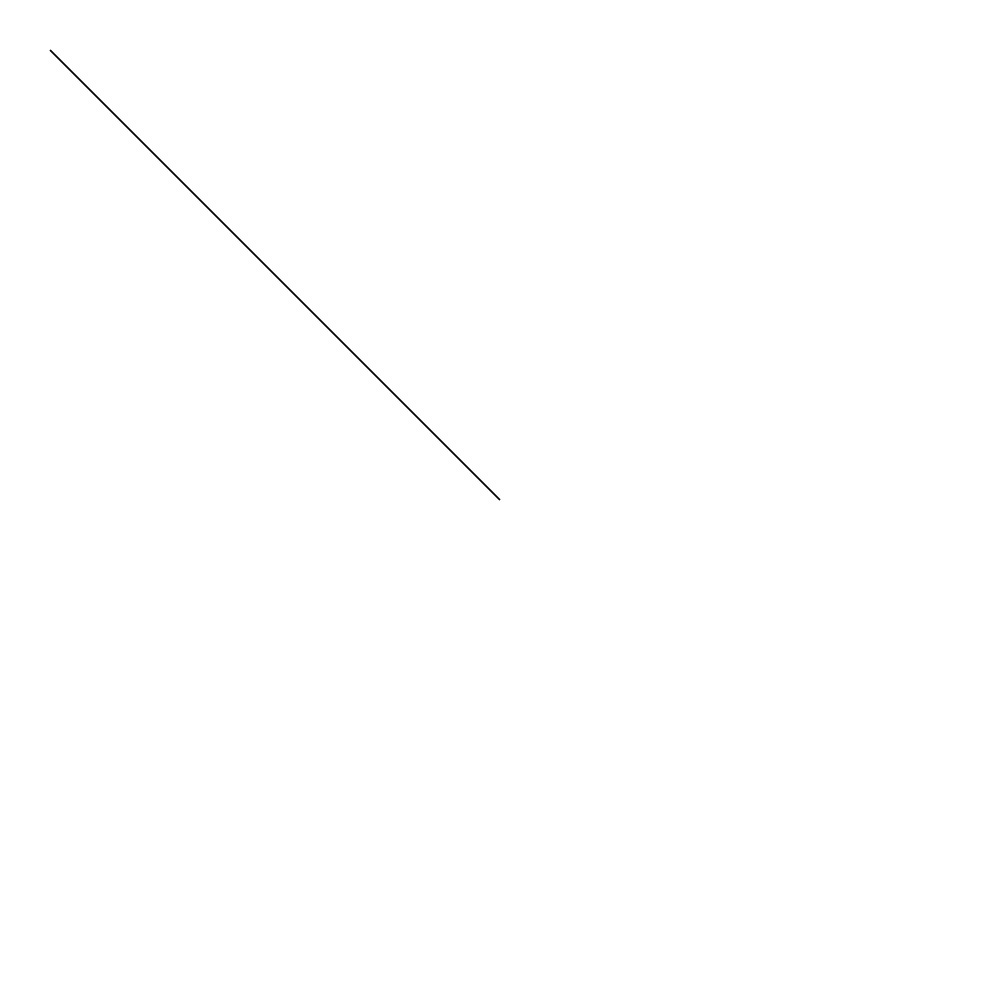

Few more lines with different positions. Note the primitive `g` which acts like an abstract container for placed shapes which in turn gets placed onto the page itself.

    from flat import document, shape, group
    
    s = shape()
    d = document(200, 200, 'mm')
    p = d.addpage()
    g = group()
    p.place(s.circle(100, 100, 5))
    p.place(s.circle(100, 100, 5)).position(20, 20)
    g.place(s.circle(100, 100, 5)).position(20, 20)
    p.place(g).position(20, 20)
    d.pdf('shape.pdf')

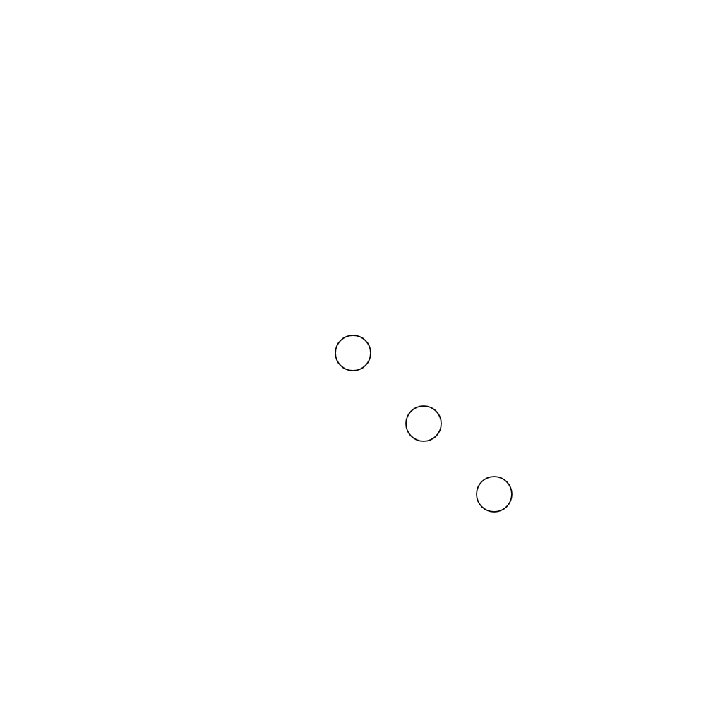

More on the customization of shapes. Note how the particular line inherits the graphical properties from parent shape and compare it to the approach taken by PostScript where one mutates a global graphical state influencing the item's appearance.

    from flat import document, shape, rgb
    
    s = shape().stroke(rgb(255, 0, 0)).width(40.0).fill(rgb(0, 0, 255))
    d = document(200, 200, 'mm')
    p = d.addpage()
    p.place(s.line(10, 10, 100, 100))
    d.pdf('shape.pdf')

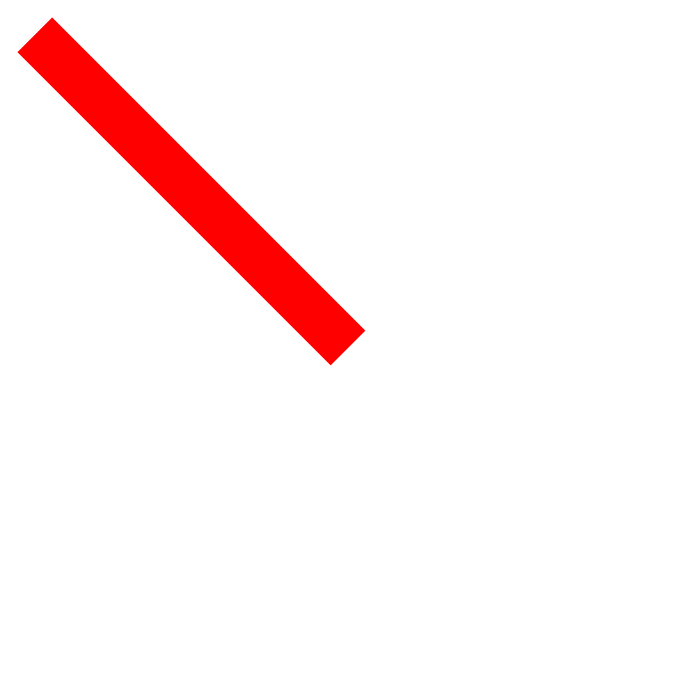

There are several colorspaces spaces supported, some of which are only applicable on the given output device or format. For example, at the time of writing, SVG does not support CMYK and overprint is only really useful for printing. When two shapes are painted on top of each other, usually a shape above erases everything below it, unless an "overprint" is specified in which case everything is painted on top of each other, layer by layer, in effect mixing (or overlaying) the various paints.

    from flat import document, shape, cmyk, overprint
    
    c = shape().stroke(overprint(cmyk(100, 0, 0, 0))).width(40.0)
    y = shape().stroke(overprint(cmyk(0, 0, 100, 0))).width(40.0)
    d = document(200, 200, 'mm')
    p = d.addpage()
    p.place(c.line(10, 10, 100, 100))
    p.place(y.line(100, 10, 10, 100))
    d.pdf('shape.pdf')

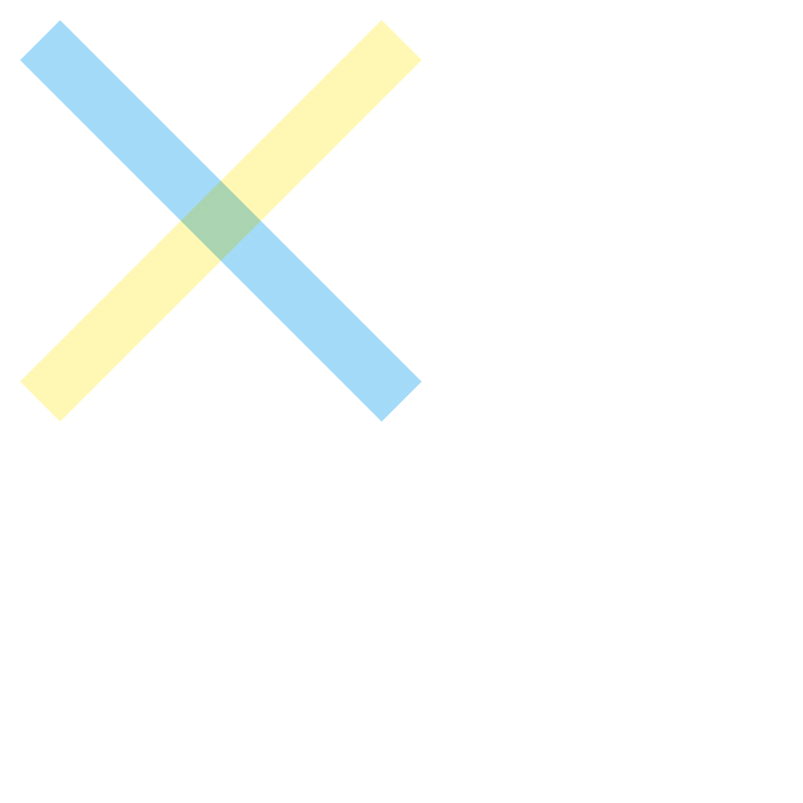

The most flexible shape is a path. It is made of a sequence of operators commanding a virtual pen, such as "move to", "line to" (draw straight line for the last point), "quad to" (draw a quadratic Bezier curve), "curve to" (draw a cubic Bezier curve), and "close path", used either to close an open shape (useful for filling of a shape or for laser/vinyl cutters) or to start a new subpath (possibly in combination with another moveto). Flat also features a rudimentary algorithm for boolean operation over polygons, meaning one can for example "subtract" one polygon from another.

    from flat import document, shape, rgb, moveto, lineto, closepath, difference
    
    a = [moveto(20, 20), lineto(100, 20), lineto(100, 100), lineto(20, 100), closepath]
    b = [moveto(40, 40), lineto(120, 40), lineto(120, 120), lineto(40, 120), closepath]
    
    r = shape().stroke(rgb(0, 0, 0))
    s = shape().stroke(rgb(255, 0, 0))
    c = shape().stroke(rgb(0, 0, 255))
    d = document(200, 200, 'mm')
    p = d.addpage()
    p.place(s.path(a))
    p.place(c.path(b))
    p.place(r.path(difference(a, b)))
    d.pdf('shape.pdf')

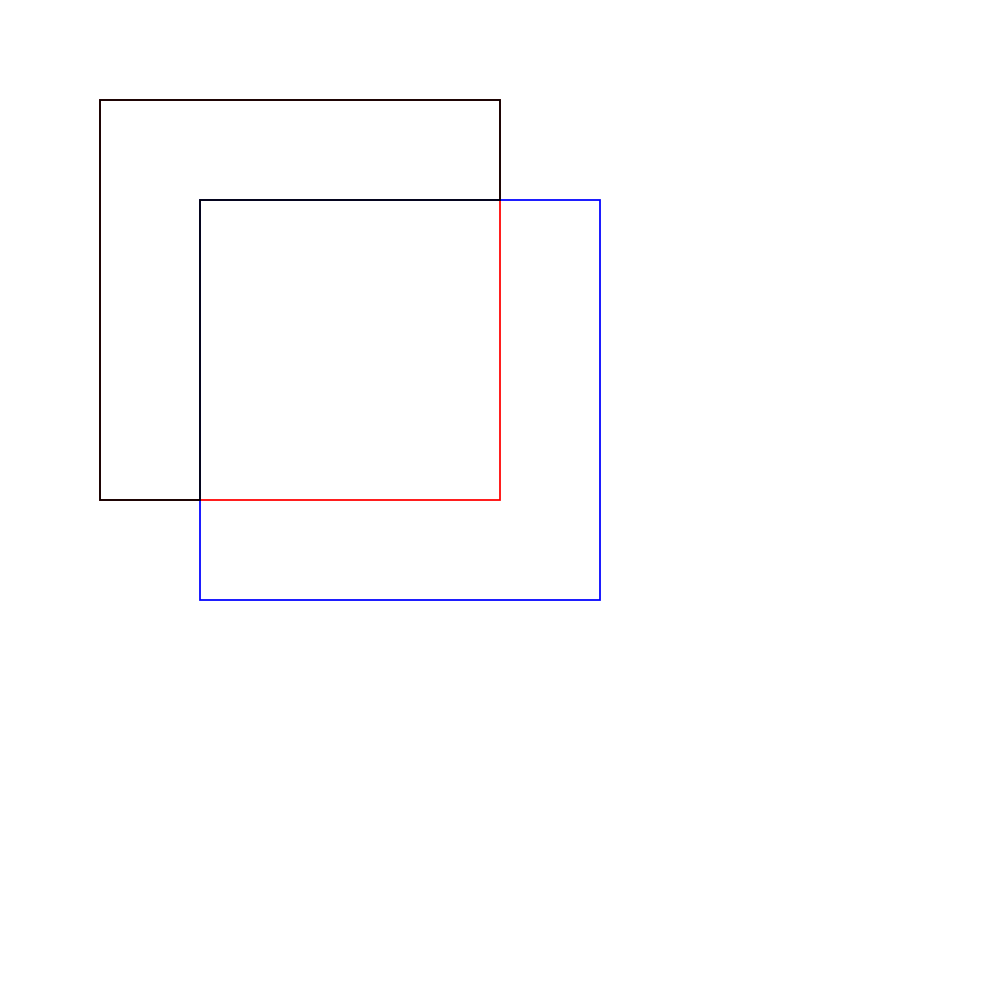

#### Text

Similarly to shapes, text also operates by the factory metaphor. What was `shape` is now `strike`, that is a construction facility producing various elements of text with given properties. Text in Flat consist of paragraphs and each paragraph is made of spans. In order to create a strike, one needs a font. The following example opens one, creates a strike with it, sets it up with the given text size (in typographic "points", 1pt = 1/72"). Then it creates text with one paragraph and one span in single step, and places the text on the page. By default the text is placed into infinitely large text frame.

    from flat import document, font, strike
    
    regular = font.open('assets/Vollkorn-Regular.otf')
    body = strike(regular).size(64)
    
    d = document(200, 200, 'mm')
    p = d.addpage()
    p.place(body.text('Hello world!'))
    d.pdf('text.pdf')

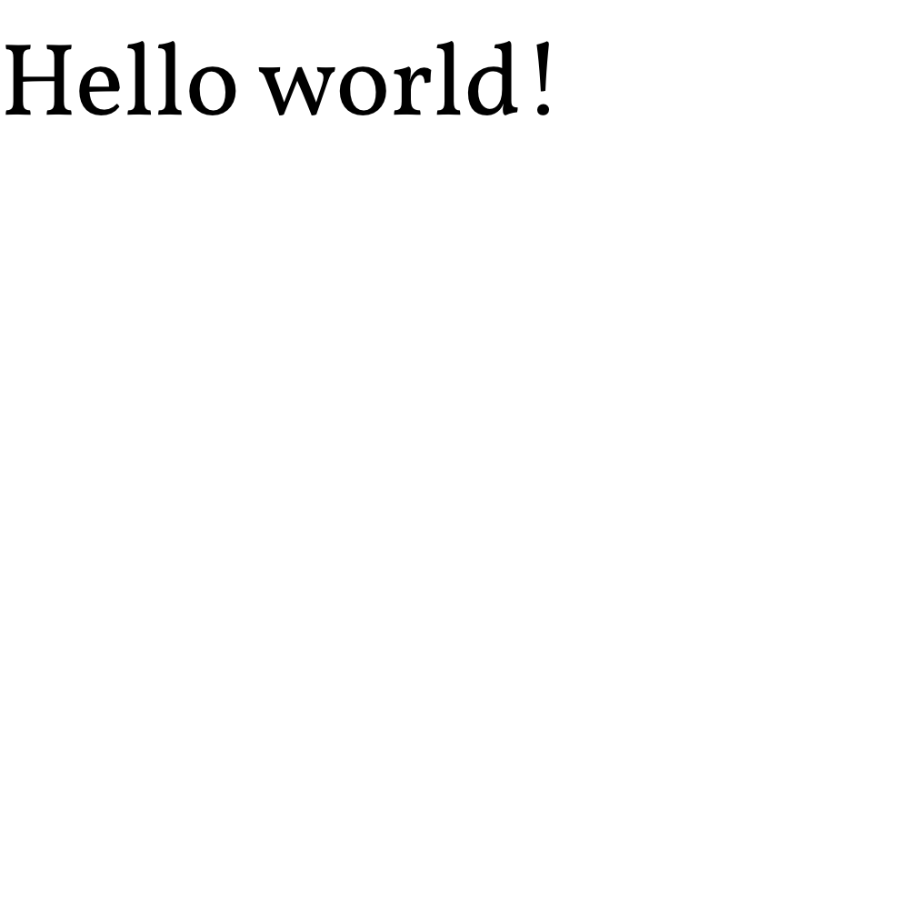

Text can also be set with several styles by employing different strikes.

    from flat import document, font, strike, text, paragraph, rgb
    
    regular = font.open('assets/Vollkorn-Regular.otf')
    thin = font.open('assets/WorkSans-Light.ttf')
    body = strike(regular).size(64).color(rgb(0, 0, 0))
    head = strike(thin).size(92).color(rgb(0, 0, 255))
    
    d = document(200, 200, 'mm')
    p = d.addpage()
    p.place(text([paragraph([body.span('Hello '), head.span('world!')])]))
    d.pdf('text.pdf')

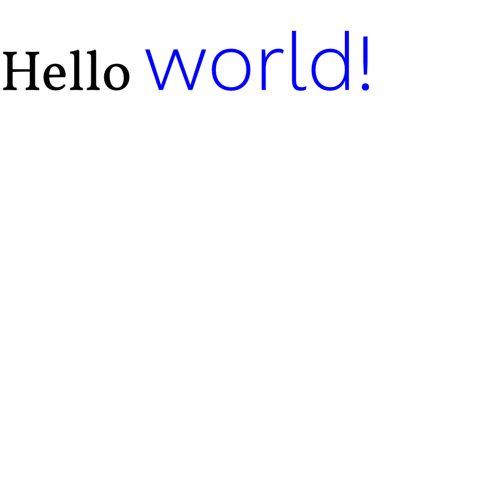

And text can even flow along several text frames by "chaining" them and possibly creating as many text frames as needed by checking whether they still overflow.

    from flat import document, font, strike
    
    regular = font.open('assets/Vollkorn-Regular.otf')
    body = strike(regular).size(64)
    
    d = document(200, 200, 'mm')
    p = d.addpage()
    b = p.place(body.text('Hello world!')).frame(10, 10, 100, 40)
    if b.overflow():
        p.chain(b).frame(100, 100, 100, 40)
    d.pdf('text.pdf')

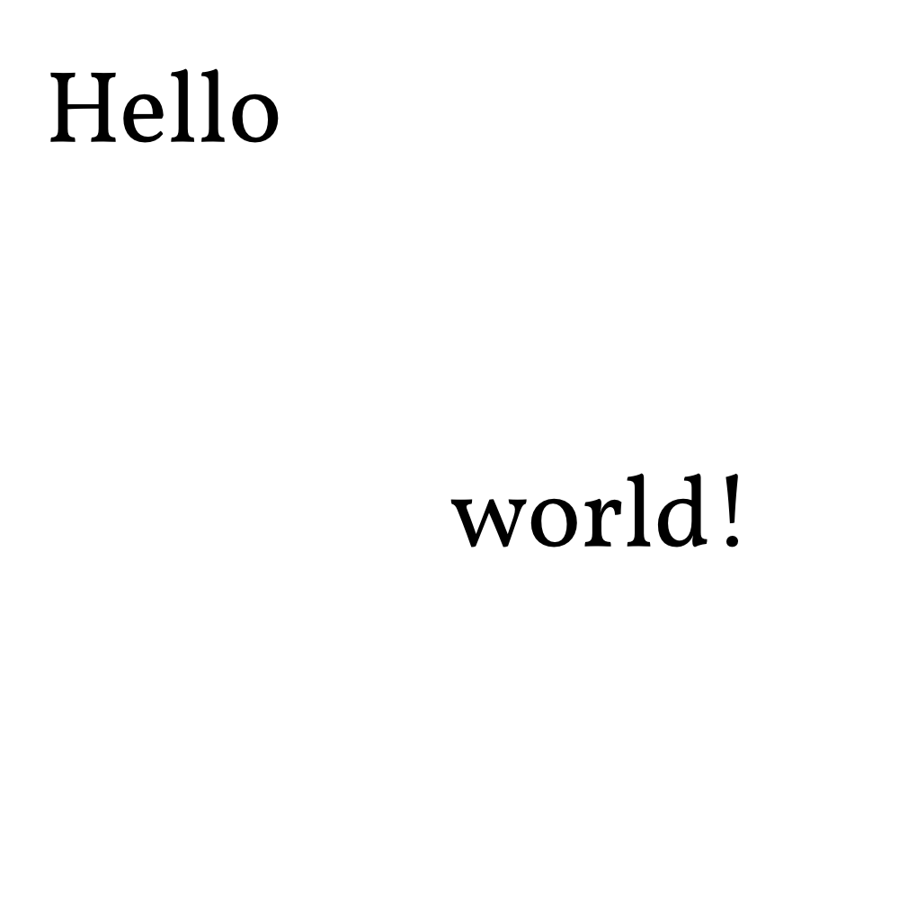

Sometimes an application (e.g., a pen plotter) might require that the document does not contain any fonts or that the text is broken into respective Bezier curves. For that there are outlines, which, as the name implies, convert the glyphs' boundaries to paths.

    from flat import document, font, strike
    
    regular = font.open('assets/Vollkorn-Regular.otf')
    body = strike(regular).size(64)
    
    d = document(200, 200, 'mm')
    p = d.addpage()
    p.place(body.outlines('Hello world!'))
    d.pdf('text.pdf')

#### Image

Somewhat similar to both shape and text is image in that it can also be opened and placed onto a page.

    from flat import document, image
    
    i = image.open('assets/test.png')
    
    d = document(200, 200, 'mm')
    p = d.addpage()
    p.place(i).position(10, 10).fitwidth(100)
    d.pdf('image.pdf')

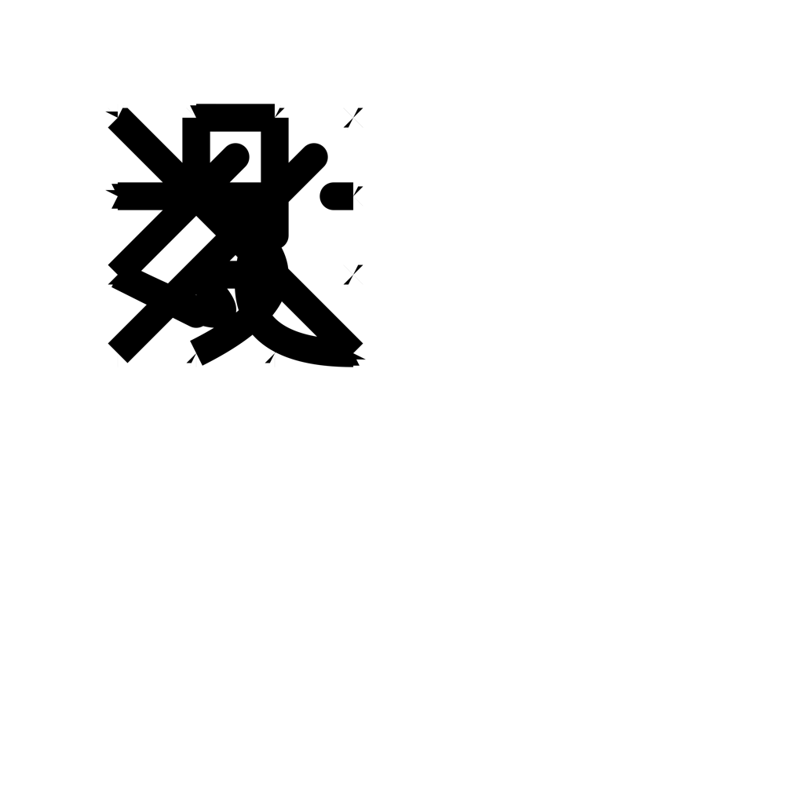

One can even put a shape on a page, rasterize it, and place the resulting image into the page again.

    from flat import document, shape
    
    s = shape().width(40)
    d = document(200, 200, 'mm')
    p = d.addpage()
    p.place(s.line(10, 10, 100, 100))
    i = p.image()
    p.place(i).frame(10, 10, 40, 40)
    d.pdf('image.pdf')

It is also possible to work with just image, without a document, for example to create an image from scratch.

    from flat import image
    i = image(256, 256, 'rgb')
    for y in range(256):
        for x in range(256):
            i.put(x, y, (x, x, x))
    i.jpeg('image.jpg')

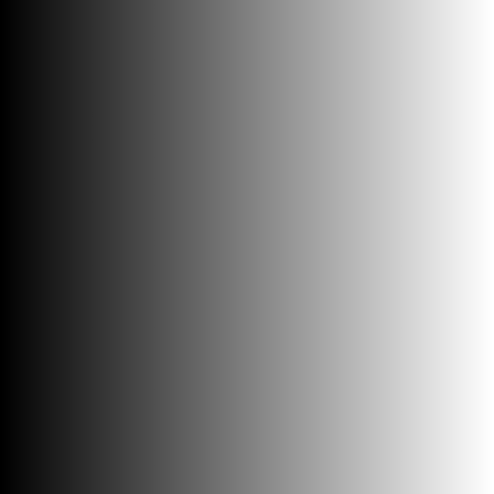

Or to create a thumbnail of another image.

    from flat import image
    
    i = image.open('assets/test.png')
    i.resize(0, 100)
    i.png('test-small.png')

#### Appendix: Random dots

Scatter tiny black dots around the canvas ([source code](random-dots.py)).

    from random import random
    from flat import document, shape, gray
    
    d = document(100, 100, 'mm')
    p = d.addpage()
    figure = shape().nostroke().fill(gray(0))
    
    for i in range(10000):
        x = random()*96.0 + 2.0
        y = random()*96.0 + 2.0
        r= random()**2
        p.place(figure.circle(x, y, r))
    
    d.pdf('random-dots.pdf')

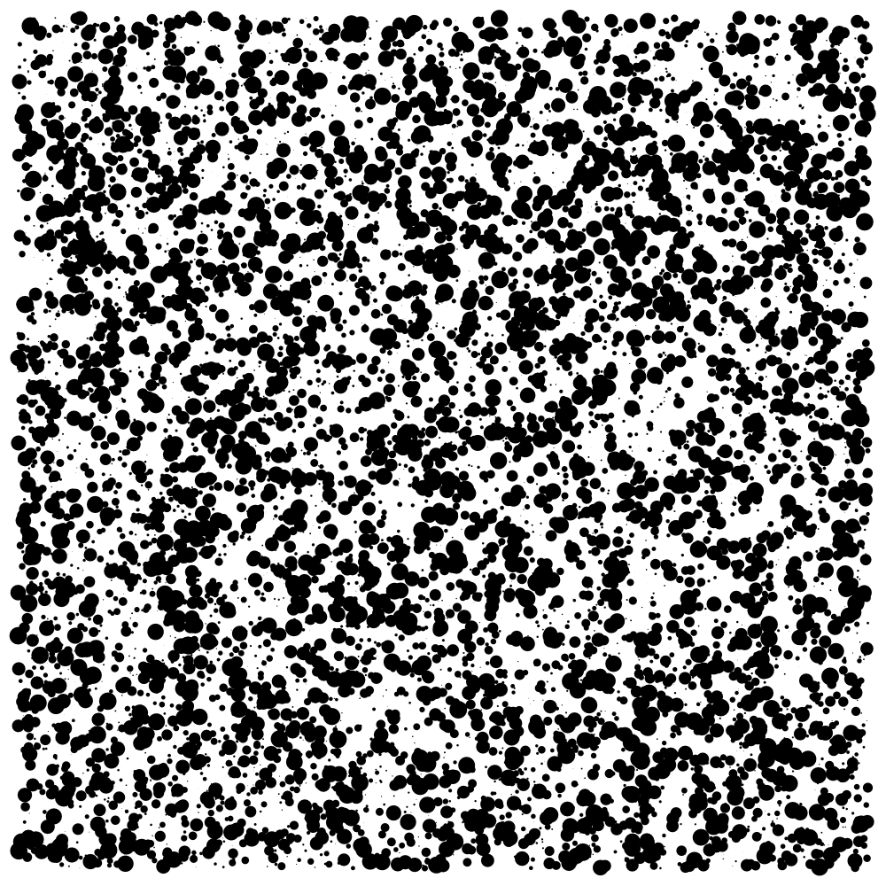

